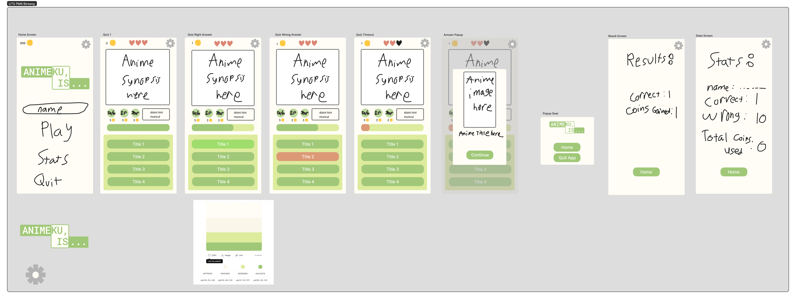

# UTS Pemrograman Mobile

## Dibuat Oleh
Nama : Bintang Khalik Muhammad 

NIM : 231401075 

LAB : 6

## Deskripsi Aplikasi

Animeku, is... adalah aplikasi quiz pilihan berganda dimana pengetahuan player mengenai hal-hal anime akan diuji. Player harus dapat membedakan anime-anime dari synopsis yang diberikan. 

Terdapat juga beberapa fungsi hint yang dapat dibeli untuk membantu player dengan pengetahuan anime yang rendah, contohnya adalah sebagai berikut.

EP untuk menampilkan jumlah episode anime tersebut, \
Year untuk menampilkan tahun terbit anime tersebut.

## Mockup Aplikasi

## Credit

Data Anime : [Kaggle](https://www.kaggle.com/datasets/dbdmobile/myanimelist-dataset/data)

Font : [Komika](https://www.dafont.com/komika-text.font?l[]=10&l[]=1)